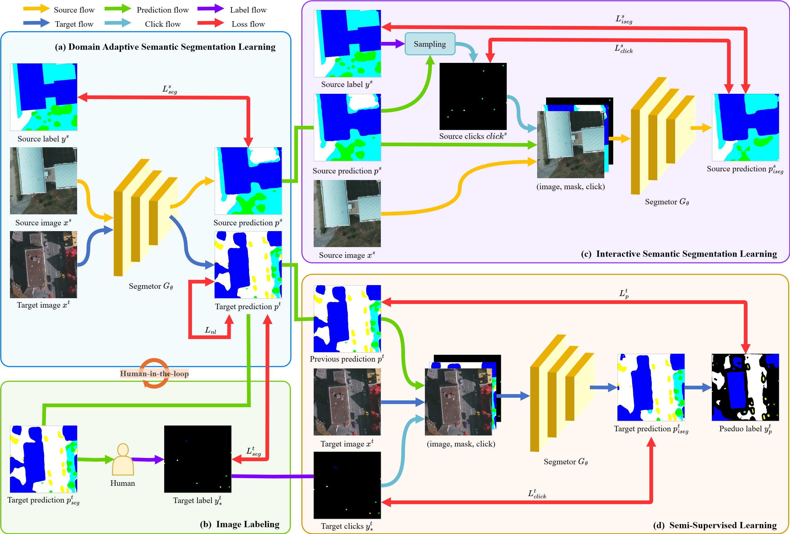
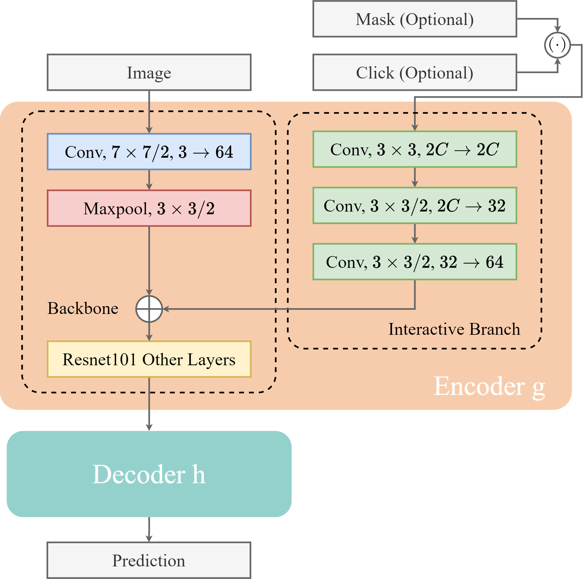

---

<div align="center">    

# EasySeg: an Error-Aware domain adaptation framework for remote Sensing imagerY semantic SEGmentation via interactive learning and active learning


</div>


## Overview
We explore a novel active domain adaptation (ADA) method for semantic segmentation in remote sensing imagery. We introduce our EasySeg framework, emphasizing the efficient utilization of target domain data. We propose the SFAL labeling strategy to make point-level active domain adaptation error aware while ensuring ease and efficiency in the labeling process. To harness the full potential of labeled target data, we design ISS-Net to generate accurate and dense pseudo-labels. To fully leverage unlabeled target data, we apply consistency regularization to mitigate training noise and enhance model robustness.

We show the overview of the proposed EasySeg, 



illustration of our ISS-Net with resnet101 as backbone, 



and our consistency regularization.


For more information on EasySeg, please check our paper.

## Usage
### Prerequisites
- Python 3.8
- Pytorch 1.8.0
- torchvision 0.9.0

Step-by-step installation

```bash
conda create --name EasySeg -y python=3.8
conda activate EasySeg

# this installs the right pip and dependencies for the fresh python
conda install -y ipython pip

# this installs required packages
pip install -r requirements.txt

```

### Data Preparation

- Download [The Potsdam Dataset](https://www.isprs.org/education/benchmarks/UrbanSemLab/2d-sem-label-potsdam.aspx), [The Vaihingen Dataset](https://www.isprs.org/education/benchmarks/UrbanSemLab/2d-sem-label-vaihingen.aspx), and [The Semantic Drone Dataset](http://dronedataset.icg.tugraz.at)

The data folder should be structured as follows:

```
├── datasets/
│   ├── potsdam/     
|   |   ├── train/
|   |   |   ├── images/
|   |   |   ├── labels/
|   |   ├── test/
|   |   |   ├── images/
|   |   |   ├── labels/
|   |   ├── potsdam_label_info.p
│   ├── vaihingen/
|   |   ├── images/
|   |   |   ├── images/
|   |   |   ├── labels/
|   |   ├── labels/
|   |   |   ├── images/
|   |   |   ├── labels/
|   |   ├── vaihingen_label_info.p
│   └──	drone
|   |   ├── images/
|   |   |   ├── images/
|   |   |   ├── labels/
|   |   ├── labels/
|   |   |   ├── images/
|   |   |   ├── labels/
|   |   ├── drone_label_info.p
```


### Training

We provide the training scripts using Multiple GPUs.

```bash
# training for Potsdam to Vaihingen (Deeplabv3plus-ResNet101)
python -m torch.distributed.launch \
	--nproc_per_node=<num_gpu> \
	--master_addr=localhost \
	--master_port=<port> \
	train.py \
	-cfg configs/EasySeg/P2V/deeplabv3plus_r101.yaml \
	OUTPUT_DIR results/EasySeg_P2V_V3BASED

# training for Potsdam to Vaihingen (Deeplabv2-ResNet101)
python -m torch.distributed.launch \
	--nproc_per_node=<num_gpu> \
	--master_addr=localhost \
	--master_port=<port> \
	train.py \
	-cfg configs/EasySeg/P2V/deeplabv2_r101.yaml \
	OUTPUT_DIR results/EasySeg_P2V_V2BASED
	
# training for Potsdam to Semantic Drone (Deeplabv3plus-ResNet101)
python -m torch.distributed.launch \
	--nproc_per_node=<num_gpu> \
	--master_addr=localhost \
	--master_port=<port> \
	train.py \
	-cfg configs/EasySeg/P2D/deeplabv3plus_r101.yaml \
	OUTPUT_DIR results/EasySeg_P2D_V3BASED

# training for Potsdam to Semantic Drone (Deeplabv2-ResNet101)
python -m torch.distributed.launch \
	--nproc_per_node=<num_gpu> \
	--master_addr=localhost \
	--master_port=<port> \
	train.py \
	-cfg configs/EasySeg/P2D/deeplabv2_r101.yaml \
	OUTPUT_DIR results/EasySeg_P2D_V2BASED
```

### Testing
To evaluate EasySeg e.g. Potsdam to Vaihingen (Deeplabv3plus-ResNet101), use the following command:
```bash
python test.py -cfg configs/EasySeg/deeplabv3plus_r101.yaml resume checkpint/EasySeg_P2V_V3BASED/model_last.pth OUTPUT_DIR checkpint/EasySeg_P2V_V3BASED
```


## Acknowledgements
This project is based on the following open-source projects: [RIPU](https://github.com/BIT-DA/RIPU) and [UniMatch](https://github.com/LiheYoung/UniMatch). We thank their authors for making the source code publically available.


## Contact

If you have any problem about our code, feel free to contact

- [yangliangzhe2000@163.com](yangliangzhe2000@163.com)

or describe your problem in Issues.
